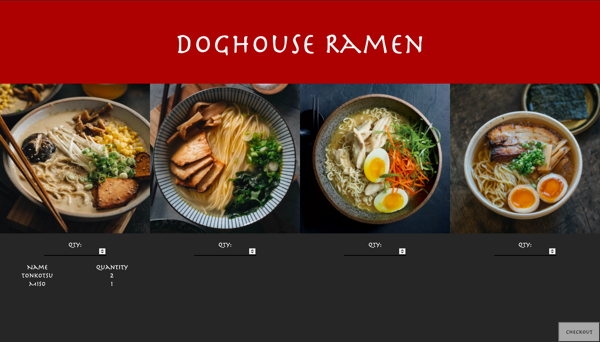
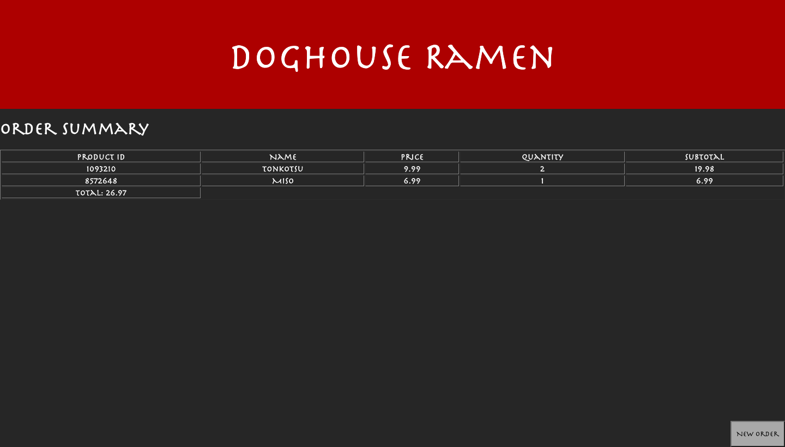

# RamenShop_SpringBoot_Project
A ramen ordering application that utilizes SpringBoot framework.

## Technologies
* [Spring Boot](https://docs.spring.io/spring-boot/docs/current/reference/htmlsingle/)
* [Java](https://docs.oracle.com/en/java/)
* [HTML](https://www.w3schools.com/TAgs/default.asp)
* [CSS](https://www.w3schools.com/css/default.asp)
* [JavaScript](https://www.w3schools.com/js/default.asp)
* [Google Fonts](https://fonts.google.com/)
* [MySQL](https://dev.mysql.com/doc/)
* [H2 Database](https://www.h2database.com/html/main.html)

## Screenshots

## Room for improvement
* Utilize better UX/UI practices 
  - make better use of whitespace
  - order page could use a better redesign (ie. use card system)
* Functionality can be scaled up 
  - create an authorization system to allow users to manage orders

